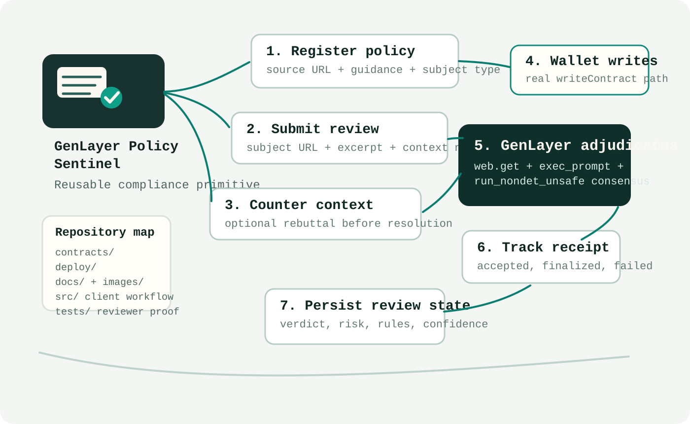
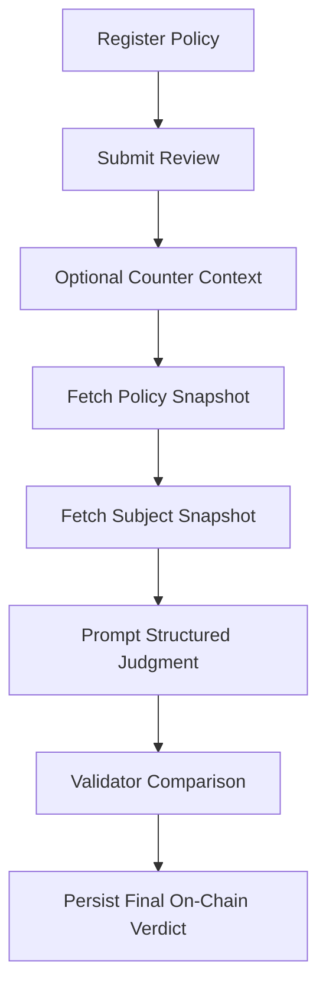

# GenLayer Policy Sentinel

GenLayer Policy Sentinel is a standalone **Intelligent Contract** primitive for
policy-backed compliance and governance reviews on GenLayer.

It is built for builders who need a reusable contract that can:

- register a policy from a real web source
- submit a document, page, listing, or proposal for review
- attach counter-context before finalization
- resolve a final verdict through GenLayer-native consensus
- persist a stable on-chain judgment for downstream apps and contracts

This repo intentionally targets `Builder -> Intelligent Contracts`, not
`Projects`. The focus is a reusable primitive, clear state design, meaningful
consensus logic, and reviewer-friendly documentation.

## Visual Overview



## Why This Fits Intelligent Contracts

This contract is not a thin wrapper around one prompt and not a learning-only
example.

It exposes a reusable building block that other GenLayer builders can plug into
their own apps for:

- moderation policy review
- DAO proposal policy checks
- vendor onboarding and disclosure review
- marketplace listing compliance checks
- treasury and grant policy screening

The core contract logic uses real GenLayer consensus signals:

- `gl.nondet.web.get(...)` to fetch policy and subject snapshots
- `gl.nondet.exec_prompt(...)` to generate a structured policy judgment
- `gl.vm.run_nondet_unsafe(...)` to compare leader and validator outcomes

The non-deterministic result materially affects contract state because the
final verdict, risk, rule references, confidence, and resolution status are
persisted only after consensus succeeds.

## Contract Primitive

- Contract file: `contracts/genlayer_policy_sentinel.py`
- Contract name: `GenLayerPolicySentinel`
- Category target: `Builder -> Intelligent Contracts`

### Public Write Methods

- `register_policy(...)`
- `submit_review(...)`
- `submit_counter_context(...)`
- `resolve_review(...)`

### Public View Methods

- `get_policy_json(...)`
- `get_review_json(...)`
- `get_review_ids()`
- `latest_summary(...)`

## State Model

### Policy record

- policy id
- title
- subject type
- policy guidance
- policy source URL
- creator
- active flag

### Review record

- review id
- linked policy id
- subject label
- subject excerpt
- subject source URL
- context note
- counter note and counter source URL
- status
- resolved flag
- consensus finalized flag
- verdict
- risk level
- confidence
- violation count
- applicable policy rules
- rationale

This makes the primitive readable for both builders and reviewers.

## How Consensus Works

1. a builder registers a policy with real guidance and a source URL
2. another builder or app submits a subject for review
3. optional counter-context can be added before resolution
4. `resolve_review(...)` fetches the policy and subject snapshots
5. the contract asks the model for a structured compliance judgment
6. `gl.vm.run_nondet_unsafe(...)` compares leader and validator outcomes
7. only the consensus-approved result is persisted on-chain

The returned structured result contains:

- `verdict`: `compliant | non_compliant | needs_review`
- `risk_level`: `low | medium | high`
- `confidence`: `high | medium | low`
- `violation_count`: `0..20`
- `applicable_rules`
- `rationale`

## Use Cases

### 1. DAO proposal review

Check whether a governance proposal includes the disclosures or policy clauses
required by a DAO.

### 2. Marketplace compliance

Review product listings against prohibited-claim policies before publishing.

### 3. Vendor onboarding

Verify whether vendors expose required privacy, security, or terms disclosures.

### 4. Grant or treasury screening

Evaluate whether an application page or public document satisfies funding
requirements before approval.

## Repository Structure

```text
genlayer-policy-sentinel/
|-- contracts/
|   `-- genlayer_policy_sentinel.py
|-- deploy/
|   `-- 001_deploy_policy_sentinel.mjs
|-- docs/
|   `-- contract-design.md
|-- examples/
|   `-- example-reviews.md
|-- scripts/
|   `-- verify-contract.mjs
|-- src/
|   `-- genlayer-policy-sentinel-client.ts
|-- submission-pack/
|   |-- JUDGE-NOTES.md
|   `-- SUBMISSION-DESCRIPTION.md
|-- tests/
|   `-- submission-proof.test.mjs
|-- .gitignore
|-- package.json
`-- README.md
```

## Directory Tree With Purpose

```text
genlayer-policy-sentinel
├─ contracts
│  └─ genlayer_policy_sentinel.py        # core intelligent contract primitive
├─ deploy
│  └─ 001_deploy_policy_sentinel.mjs     # Studionet deploy helper
├─ docs
│  ├─ contract-design.md                 # consensus and state design notes
│  └─ images
│     └─ repo-architecture.svg           # visual repo and workflow illustration
├─ examples
│  └─ example-reviews.md                 # reusable real-world review scenarios
├─ scripts
│  └─ verify-contract.mjs                # signal checker for contract primitives
├─ src
│  └─ genlayer-policy-sentinel-client.ts # real read/write client workflow
├─ submission-pack
│  ├─ JUDGE-NOTES.md                     # reviewer-facing acceptance notes
│  └─ SUBMISSION-DESCRIPTION.md          # portal-ready summary
├─ tests
│  └─ submission-proof.test.mjs          # proof that the repo is submission-ready
├─ .gitignore
├─ package.json
└─ README.md
```

## Builder Reading Path

If a reviewer or builder opens this repo for the first time, the best order is:

1. `README.md`
2. `contracts/genlayer_policy_sentinel.py`
3. `src/genlayer-policy-sentinel-client.ts`
4. `docs/contract-design.md`
5. `tests/submission-proof.test.mjs`
6. `submission-pack/JUDGE-NOTES.md`

## Flow Illustration



## Deploy Path

Studionet deploy helper:

```bash
node deploy/001_deploy_policy_sentinel.mjs
```

Expected deploy flow:

```bash
genlayer network studionet
genlayer deploy --contract contracts/genlayer_policy_sentinel.py --rpc https://studio.genlayer.com/api
```

### Live Studionet Deployment

Deployed on **July 26, 2026**:

- Contract address: `0x50C461d12aB74e2f0f9f3fe44a7823b13CCcF2A4`
- Deployment tx: `0x6babe19d6cf8dfe0e72d632e35cd15efc38413bd4d31f2b16989e45b0c3d25a3`
- Explorer contract: `https://explorer-studio.genlayer.com/contracts/0x50C461d12aB74e2f0f9f3fe44a7823b13CCcF2A4`
- Explorer transaction: `https://explorer-studio.genlayer.com/tx/0x6babe19d6cf8dfe0e72d632e35cd15efc38413bd4d31f2b16989e45b0c3d25a3`

## Minimal Client Integration

This repo includes a small builder-facing TypeScript helper:

```text
src/genlayer-policy-sentinel-client.ts
```

It shows how another builder can:

- connect a Studionet wallet
- deploy the contract
- register a policy
- submit a review request
- attach counter-context
- resolve the final outcome
- read policy and review records back

This improves reuse without turning the repo into a full frontend project.

If you want to run the helper directly, install the `genlayer-js` package version
that matches your local GenLayer SDK setup.

## Verification

Install dependencies:

```bash
npm install
```

Run the submission proof checks:

```bash
npm test
```

The proof tests verify:

- GenLayer-native non-deterministic primitives exist
- the contract exposes meaningful write and view methods
- consensus changes stored state
- the deploy path exists
- the client helper demonstrates reuse
- the README documents purpose and verification clearly

## Why This Matters Beyond One Demo

Many GenLayer apps need the same pattern:

- fetch policy or rules from the open web
- review uncertain subject content against those rules
- let validators compare the interpretation
- persist a stable verdict other systems can rely on

That makes this contract a reusable primitive for the ecosystem, not a one-off
AI demo.

## Submission Notes

Portal-facing materials are included in:

- `submission-pack/JUDGE-NOTES.md`
- `submission-pack/SUBMISSION-DESCRIPTION.md`

## License

MIT
