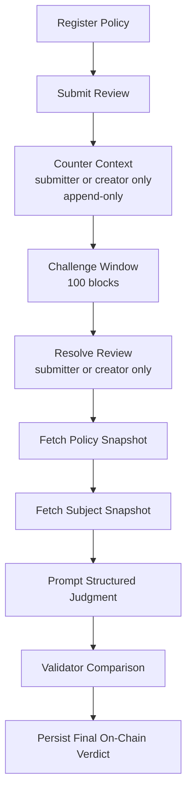

# GenLayer Policy Sentinel

GenLayer Policy Sentinel is a standalone **Intelligent Contract** primitive for
policy-backed compliance and governance reviews on GenLayer.

It is built for builders who need a reusable contract that can:

- register a policy from a real web source
- submit a document, page, listing, or proposal for review
- attach counter-context before finalization (authorization-gated, append-only)
- resolve a final verdict through GenLayer-native consensus (challenge-window protected)
- persist a stable on-chain judgment for downstream apps and contracts

This repo intentionally targets `Builder -> Intelligent Contracts`, not
`Projects`. The focus is a reusable primitive, clear state design, meaningful
consensus logic, and reviewer-friendly documentation.

## Why This Fits Intelligent Contracts

This contract is not a thin wrapper around one prompt and not a learning-only
example.

It exposes a reusable building block that other GenLayer builders can plug into
their own apps for:

- moderation policy review
- DAO proposal policy checks
- vendor onboarding and disclosure review
- marketplace listing compliance checks
- treasury and grant policy screening

The core contract logic uses real GenLayer consensus signals:

- `gl.nondet.web.get(...)` to fetch policy and subject snapshots
- `gl.nondet.exec_prompt(...)` to generate a structured policy judgment
- `gl.vm.run_nondet_unsafe(...)` to compare leader and validator outcomes

The non-deterministic result materially affects contract state because the
final verdict, risk, rule references, confidence, and resolution status are
persisted only after consensus succeeds.

## Review Lifecycle Integrity

The review lifecycle enforces two integrity guards:

### Authorization

Both `submit_counter_context` and `resolve_review` are restricted to the review
submitter and the policy creator. Unrelated callers are rejected.

### Append-Only Counter-Context

Counter-context entries are stored as an append-only list (`counter_entries`).
Each entry records the author, note, source URL, and block number. New entries
are appended — never overwritten. Legacy fields (`counter_note`,
`counter_source_url`) are kept for backward compatibility and reflect the latest
entry.

### Challenge Window

After counter-context is submitted, `resolve_review` cannot be called until 100
blocks have passed since the last counter entry. This gives the other party time
to respond before finalization.

## Contract Primitive

- Contract file: `contracts/genlayer_policy_sentinel.py`
- Contract name: `GenLayerPolicySentinel`
- Category target: `Builder -> Intelligent Contracts`

### Public Write Methods

| Method | Authorization | Description |
|--------|--------------|-------------|
| `register_policy(...)` | Any caller | Register a new policy with title, guidance, and source URL |
| `submit_review(...)` | Any caller | Submit a subject for review against a registered policy |
| `submit_counter_context(...)` | Submitter or policy creator only | Append counter-context (append-only, cannot overwrite) |
| `resolve_review(...)` | Submitter or policy creator only | Run consensus and finalize verdict (challenge-window enforced) |

### Public View Methods

| Method | Description |
|--------|-------------|
| `get_policy_json(...)` | Read full policy record |
| `get_review_json(...)` | Read full review record |
| `get_review_ids()` | List all review IDs |
| `latest_summary(...)` | One-line review status summary |

## State Model

### Policy record

- policy id
- title
- subject type
- policy guidance
- policy source URL
- creator (address)
- active flag

### Review record

- review id
- linked policy id
- subject label
- subject excerpt
- subject source URL
- context note
- counter note and counter source URL (legacy, latest entry)
- **counter entries** (append-only list with author, note, source URL, block number)
- submitter (address)
- status
- resolved flag
- consensus finalized flag
- verdict
- risk level
- confidence
- violation count
- applicable policy rules
- rationale

## How Consensus Works

1. A builder registers a policy with real guidance and a source URL
2. Another builder or app submits a subject for review
3. Optional counter-context can be added (submitter or policy creator only)
4. If counter-context is added, a challenge window of 100 blocks is enforced
5. `resolve_review(...)` fetches the policy and subject snapshots
6. The contract asks the model for a structured compliance judgment
7. `gl.vm.run_nondet_unsafe(...)` compares leader and validator outcomes
8. Only the consensus-approved result is persisted on-chain

### Consensus Validation

- Leader and validator verdicts must match exactly
- Risk levels must match exactly
- Violation counts must agree within ±1
- A `needs_review` verdict cannot be paired with high confidence from the validator

### Structured Result

- `verdict`: `compliant | non_compliant | needs_review`
- `risk_level`: `low | medium | high`
- `confidence`: `high | medium | low`
- `violation_count`: `0..20`
- `applicable_rules`
- `rationale`

## Use Cases

### 1. DAO proposal review

Check whether a governance proposal includes the disclosures or policy clauses
required by a DAO.

### 2. Marketplace compliance

Review product listings against prohibited-claim policies before publishing.

### 3. Vendor onboarding

Verify whether vendors expose required privacy, security, or terms disclosures.

### 4. Grant or treasury screening

Evaluate whether an application page or public document satisfies funding
requirements before approval.

## Repository Structure

```text
genlayer-policy-sentinel/
├── contracts/
│   └── genlayer_policy_sentinel.py        # core intelligent contract primitive
├── deploy/
│   └── 001_deploy_policy_sentinel.mjs     # Studionet deploy helper
├── docs/
│   ├── contract-design.md                 # consensus and state design notes
│   └── images/
│       └── repo-architecture.svg          # visual repo and workflow illustration
├── examples/
│   └── example-reviews.md                 # reusable real-world review scenarios
├── scripts/
│   └── verify-contract.mjs                # signal checker for contract primitives
├── src/
│   └── genlayer-policy-sentinel-client.ts # real read/write client workflow
├── submission-pack/
│   ├── JUDGE-NOTES.md                     # reviewer-facing acceptance notes
│   └── SUBMISSION-DESCRIPTION.md          # portal-ready summary
├── tests/
│   └── submission-proof.test.mjs          # proof that the repo is submission-ready
├── .gitignore
├── package.json
└── README.md
```

## Flow Illustration



## Live Studionet Deployment

Deployed on **July 31, 2026** (updated with authorization + challenge window):

| Field | Value |
|-------|-------|
| Contract address | `0x5A1aA94D9cc04eEA5AB7e1d69d8b437C423498cE` |
| Deployment tx | `0x330f9317fb080dffed4802be714d5945ddfbc3604f30c2b7c5d857393697ee38` |
| Network | GenLayer Studionet (Chain ID 61999) |
| Explorer contract | https://explorer-studio.genlayer.com/address/0x5A1aA94D9cc04eEA5AB7e1d69d8b437C423498cE |
| Explorer transaction | https://explorer-studio.genlayer.com/tx/0x330f9317fb080dffed4802be714d5945ddfbc3604f30c2b7c5d857393697ee38 |

### Previous deployment (July 26, 2026 — before integrity fix)

| Field | Value |
|-------|-------|
| Contract address | `0x50C461d12aB74e2f0f9f3fe44a7823b13CCcF2A4` |
| Deployment tx | `0x6babe19d6cf8dfe0e72d632e35cd15efc38413bd4d31f2b16989e45b0c3d25a3` |

## Minimal Client Integration

This repo includes a small builder-facing TypeScript helper:

```text
src/genlayer-policy-sentinel-client.ts
```

It shows how another builder can:

- connect a Studionet wallet
- deploy the contract
- register a policy
- submit a review request
- attach counter-context (with authorization check)
- resolve the final outcome (with challenge window awareness)
- read policy and review records back

## Verification

Install dependencies:

```bash
npm install
```

Run the submission proof checks:

```bash
npm test
```

The proof tests verify:

- GenLayer-native non-deterministic primitives exist
- the contract exposes meaningful write and view methods
- consensus changes stored state
- the deploy path exists
- the client helper demonstrates reuse
- the README documents purpose and verification clearly

## Deploy

```bash
genlayer network studionet
genlayer deploy --contract contracts/genlayer_policy_sentinel.py
```

## Why This Matters Beyond One Demo

Many GenLayer apps need the same pattern:

- fetch policy or rules from the open web
- review uncertain subject content against those rules
- let validators compare the interpretation
- persist a stable verdict other systems can rely on

That makes this contract a reusable primitive for the ecosystem, not a one-off
AI demo.

## License

MIT
